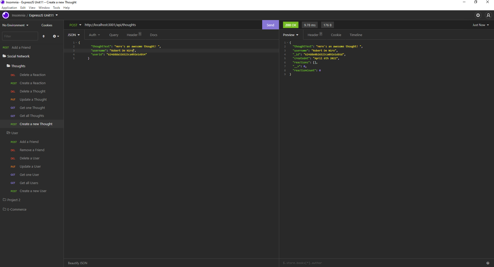

# Wire
[](https://opensource.org/licenses/MIT)

## Description

The purpose of this repository is to create an API server made with MongoDB and Mongoose. This API will allow the user to Create, Read, Update, and Delete new and existing users as well as new and existing "thoughts". The user will also be able to update any user's friends list by adding or removing other users as friends. The user will also be able to update any thought's reactions list by adding or removing reactions of any specifici thought. This repository has no front-end and the API routes can be accesed via Insomnia to test the server.

Functionality Video (All API calls made in Insomnia): https://drive.google.com/file/d/11crIo8yHVVDNNGpFmWACqhankQYT3phK/view




*You can find all the API calls made in the functionality video

## Table of Contents 

- [Installation](#installation)

- [Usage](#usage)

- [License](#license)

- [Contributing](#contributing)

- [Tests](#tests)

- [Questions](#questions)

## Installation

To install necessary dependencies, follow the next steps and run these commands:

```bash
npm i
```

## Usage

To run Wire, open your terminal and enter the next command:
```bash
npm run start
```
## License

This project is licensed under the MIT license

## Contributing

Sole contributor: AndreV96

## Questions

If you have any questions about the repository, open an issue or contact me directly at ventaslederer@hotmail.com . You can find more of my work at [https://github.com/AndreV96](https://github.com/AndreV96/).

